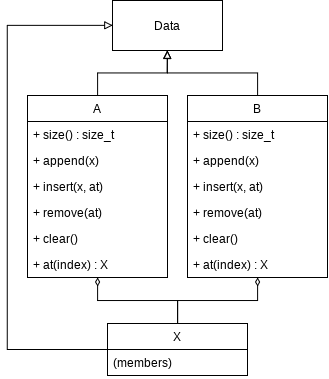
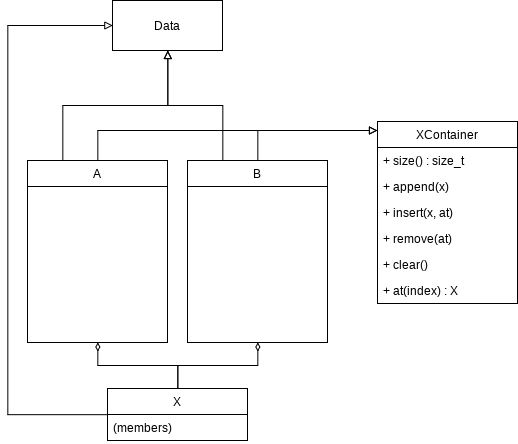
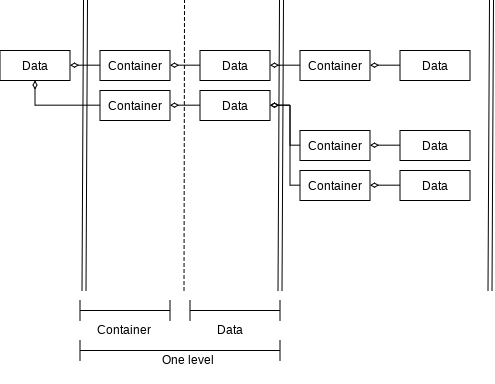
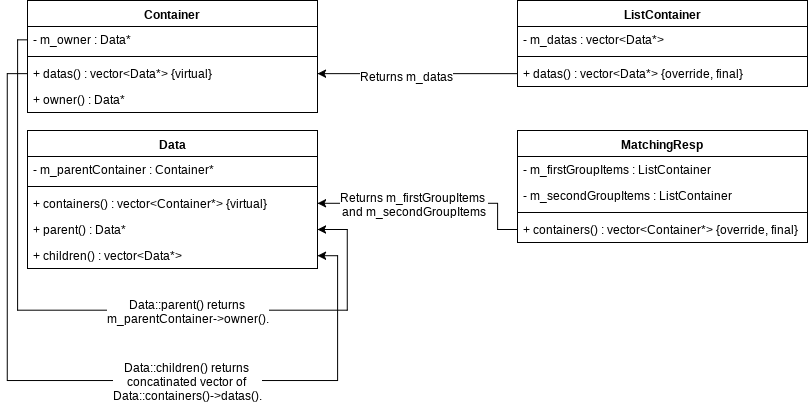
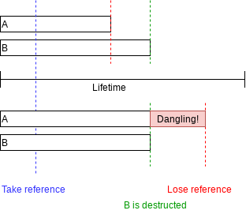
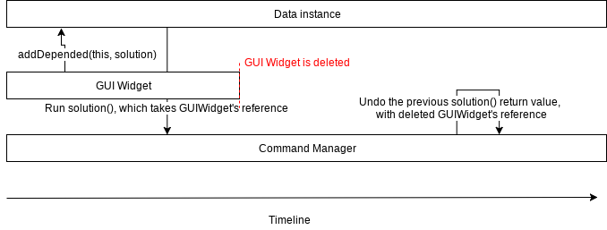

Chapter 1. Basic Data Module
================================

In this and next chapter, how to prepare base code to form data tree
will be introduced. Regardless of which data type will be dealt with in
your editor, the base code, at least it's principle will not change.

You need to open the source code committed with message
``001. Basic Data module`` before read the extra chapter.

Superclass of All Data Classes
--------------------------------

Though every data representing classes have different data, they are data
objects which consist data tree, and it's always good to have one common
superclass. I'll name the superclass ``Data``. There are some basic
requirements applied to ``Data``, listed below.

* Know what its parent is.
* Know what its children are.
* Know what its type is.

Class ``Data`` is declared and defined in ``data.h`` and ``data.cpp``. In
the definition, there are methods ``type()``, ``children()`` and ``parent()``
to fulfill the requirements above. ``type()`` is pure virtual function, and
its subclass should return corresponding enum in its implementation.

You may wondering what ``parentContainer()`` and ``containers()`` are, and
why ``children()`` and ``parent()`` methods are not pure virtual
even though ``Data`` does not
know about its children since they will be defined in the subclass.

Interfacing Data as Data Container
$$$$$$$$$$$$$$$$$$$$$$$$$$$$$$$$$$$$$$

Background
%%%%%%%%%%%%%%%%%%%

Assume there are subclass of ``Data``, A, B, and X. A and B are list
container of X.

A and B have same interface, so it will be good idea to make common interface
something like ``XContainer``. There are several ways to make interface, and
the most popular way in OOP is creating
pure abstract class(called as interface, in Java).

Now A and B can be dealt as ``XContainer``. However the problem is not gone
yet, because **a** ``Data`` **subclass is not a container for only one type
of** ``Data``\ **.** For example, our ``MatchingResp`` type takes 2 lists of
``MatchingRespItem``, and there's no way to inherit something like
``MatchingRespItemContainer`` twice. To solve this situation,
*A data is container of container of children data* pattern is introduced.

Solution
%%%%%%%%%%%%%%%%

The problem comes from violation of the OOP rule: One class plays one role.

There are 2 relationships between 2 different objects, one is *has-a* and
the another is *is-a*. You may have heard about these 2
relationships in your first
C++ programming cookbook, with addition information that
public inheritance should be used when two classes have *is-a* relationship.
In this case, it seems that A(or B) and ``XContainer`` are
*is-a* relationship for each
other, but actually it is *has-a* relationship for A(or B) and X. That's the
reason why this problem cannot be solved by inheritance. Then what we need to
use to make *has-a* relationship? **Take children container as member.**

The image above shows how our ``Data`` subclasses have their children.
Instead of having its children directly, ``Data`` subclass take
abstract class ``Container`` which has children. In this way, ``Data`` subclass
can have multiple ``Container``\ s without any problem.

It explains ``parentContainer()``, ``containers()``, ``children()``, and
``parent()`` methods. ``parentContainer()`` is the only virtual function
related to parent-child relationship of ``Data``. ``children()`` returns
all the ``Data`` instances comes from ``containers()``. ``parent()`` returns
owner of ``parentContainer()``.

Dependency of Object
$$$$$$$$$$$$$$$$$$$$$$$$$$$$$

``addDepended()``, ``removeDepended()``, and ``solution()`` are functions
for object dependency management.
Before we explore what 3 methods above are, understanding of dependency
problem should be preceded.

Background
%%%%%%%%%%%%%%%%%%%%%%%

Object referring has always been one of the most crucial issue in programming.
By using referring instead of copying object, programmers could have got
performance improvement and kept an object's uniqueness. But like there's
shadow on the other side of the light, it comes with object lifetime issue.
Programming without care of lifetime will cause dangling pointer issue
in C/C++.

Assume that there are 2 objects, A and B. A take reference of B. If A
dereference before B is destructed, everybody can have smiley face.
The frowning starts, when A takes longer referring time than B's lifetime.

The image above exactly shows the previous case. In the upper case,
lossing reference happens prior to B is destructed, while the lower case
does not. If actual referring(not just taking reference, but try to do
something with the reference) happens, that's the point where we get
segmentation fault, and that's the reason why programmers have stack of
empty coffee cups beside them till the midnight.

Solution
%%%%%%%%%%%%%%%%

This is not technical problem, but it's logical one. Just like dead solders
cannot hear cry of their family, like we cannot eat an apple which does not
exist, we cannot access to object which is already deleted.

There are 2 solutions: one is let A dereferences when B is deleted, and
the another is let B alive until A dereferences. To achieve
*dereference-when-deleted*, B should let A knows if B is deleted. For
*deleting-waits-until-dereferenced*, A should take ownership of B with
something like ``std::shared_ptr``. The first one is much more complex than
the second one which simply use one more smart pointer, because B should
refer A as well to let A knows B's deletion.

The first solution will be applied to our ``Data`` dependency management,
because different ``Data`` subclass instances should not affect to each
other's lifetime unless they have parent-child relationship.

Going back to our code review, ``addDepended()``, ``removeDepended()``,
``purgeDepended()``, and ``solution()`` are used to manage dependency.
``addDepended()`` takes *depended target identifier*\ (*DTI*) and *solution*.
*DTI* is used to identify depended objects. Depended objects can be classified
into 2 types in our case, ``Data`` subclass instances and non-``Data`` subclass
instances. ``Data`` subclass instances uses its child container's pointer as
identifier, and other C++ instances can use ``DependencyKey`` type to
identify itself from other instances. ``DependencyKey`` is a value type
which has nothing but occupies specific size of memory. It looks like this,

.. code-block:: cpp

	#define DEPENDENCY_KEY_SIZE (sizeof(nullptr) * 2)
	class DependencyKey { char m_data[DEPENDENCY_KEY_SIZE]; }

Other C++ instances are unknown for ``Data``\ 's point of view, so it just
let them freedom to fill this chunk of data, but give them responsibility
to make not-crashing key.

The *solution* is a command object which knows how to solve the dependency.
When it's run, dereferencing occurs. Undoing the command will reference occurs
again. That *solution*\ s are stored in a map container, so that running
all the solutions let the ``Data`` instance is safe to be deleted.
A container which contains every *solution* of a ``Data`` instance,
including its children's *solution*\ s, can be got by calling
``Data::solution()``.

``purgeDepended()`` is introduced to cope with a case when a depended
object is deleted after return value of ``solution()`` is still alive.
The image above is little bit complex, and I paraphrased into ordered list
below.

#. ``Data`` is referred by ``GUIWidget``.
#. ``Data::solution()`` is called, and it's run.
#. ``GUIWidget`` is deleted. (Still, ``Data::solution()``\ 's return value
   is alive.)
#. By undoing ``Data::solution()``\ 's previous return value, you will get
   segmentation fault error.

To understand this situation well, you may need experience of writing
*solution* command object. I will have chance to explain this in the later
part of the tutorial, and until we reach there, we will never use this
function.
