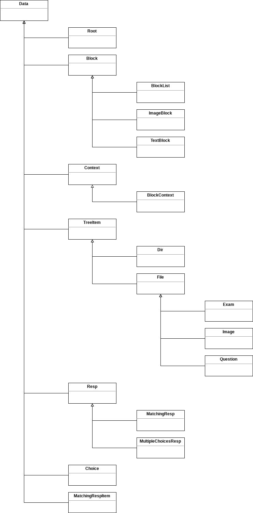

Chapter 3. Form Data Tree
=================================

In this chapter, we will implement the data tree introduced in Chapter 1.
Since forming data tree is really simple, I'll show only some examples.
The whole implementation can be found in the source code.

You need to open the source code committed with message
``003. Form Data Tree`` before read the extra chapter.

This is a simple hierarchy diagram to help understand the overall hierarchy
tree. To see the containing relationship, it's in Planning.

Implementing ``Root``: Using ``SingleContainer``
---------------------------------------------------------------------------

Open ``root.h``.

As you can see in the source code, there's literally nothing special and
complex, since we prepared the complex base classes properly.

Below one is the follow-up guide when you add a child data container.

#. Name it: in this case, it's "root dir".
#. Do type aliasing: in this case ``RootDirContainer`` is aliased to
   ``SingleContainer<Dir, std::shared_ptr<Dir>>``.
#. Declare the aliased container as member variable.
#. Provide 2 versions of getter for the container member variable, const and
   non-const version.
#. Make sure that ``Data::containers()`` are well-overridden so that it
   returns all of its children container. **Do not return container for
   refernece, which is not container for ownership.**

Beside the guide above, make sure that your new ``Data`` subclass is
registered to ``DataType`` enum class in ``data_type.h`` file, and its
``type()`` virtual method returns right ``DataType``.

Implementing ``Choice``: Using ``SinglePrimContainer``
------------------------------------------------------------

Open ``choice.h``.

``SinglePrimContainer`` is used to take a value type. The same way applied
to add this container, but since this is not a container for ``Data``,
``Data::containers()`` should not include this container.

Implementing ``ImageBlock``: Referring Other Instances
----------------------------------------------------------------------

Open ``image_block.h``.

This class has ``ImageContainer`` type alias, which is
``SingleContainer<Image, TypeEnum::Ref>``. To refer ``Data`` instances
instead of taking ownership, pass ``TypeEnum::Ref`` instead of passing
smart pointer type. ``Data::containers()`` should not include this container.
