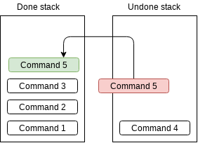

Chapter 5. Base Application Module
=========================================

In this chapter, we will write base code to make Qt application.

You need to open the source code committed with message
``005. Basic Application module`` before read the extra chapter.

Elements of an Application
-------------------------------------

We have added data module for our editor, and then what is left to be done?
Let's discover step by step.

First, we need GUI. We don't want our users have hard time with using
text-based environment, but want to provide proper GUI so that data can be
understood at a look, and people can edit data with maximizing their equipment
such as mouse and tablet.

Imaging the case that undoing, commonly known as Ctrl+Z is not working?
An editor has responsibility to keep data safe from users' mistake such as
selecting all data and deleting them, so we need command manager and command
pattern implementation for that, what we have done in the previous chapters,
except for adding command manager.

We may have some icons or effect sound. If they are placed only
in a cold storage
(not CPU cache or memory, but in HDD, SSD, Internet, etc),
it gives a lot of
inefficient result. Having a resource loader, which loads necessary resources to
memory when an application starts is a good idea.

At last, assume the case that application objects are communicating each
other to propagate events and data. An editor software may have plenty of
objects, and they will eventually form a web of dependency, which is
really hard to maintain. So here comes a concept called *context*, an
unique object constructed when the application starts and never destructed
until the application terminates. It will hold current state of the application
and sharing data and propagating events will occur via the context.

Class ``App``
----------------------------

Open ``app.h``.

This ``App`` class literally holds everything needed to form our application,
and the ``main()`` function just needs to construct it and call ``exec()``
method to launch the application.

``App`` has 5 instances from 5 different classes, ``Loader``, ``data::Root``,
``AppCmdManager``, ``Context``, and ``MainWindow``. Attention at the order
of the member instances: they are not random, but have its reason.
Resources can be required in any parts of the application are constructed,
especially the GUI part. ``Root`` is data module used from ``Context``,
``AppCmdManager`` and GUI part, so it's placed in the second position.
``AppCmdManager`` does not depends on the ``Context``, while ``Context``
uses ``AppCmdManager`` during its lifetime, so ``Context`` is followed after
``AppCmdManager``. The GUI part uses everything, so it's placed in the end.

Some new programmers may not care about the member variable order,
but they need to be cared, since it decides members' construction and
destruction order.

Except for ``App::exec()`` method, ``App`` does nothing but just takes
those 5 instances. ``App::exec()`` initializes these 5 instances and call
``QApplication::exec()`` method to initiate Qt's main loop.

Class ``Loader``
------------------------------

Open ``loader.h``.

Loader has 2 core functions, ``load()`` and ``unload()``. As their names are
saying, ``load()`` loads resources from cold storages and ``unload()`` simply
free the memory allocated by the resources. My implementation calls
``unload()`` is called when destructor of ``Loader`` is invoked, to prevent
potential memory leak. (But my ``unload()`` implementation does nothing as well,
because there's no resources to be freed except for some ``std::string``\ s)

Methods starts from ``html_*()`` will be used to exporting HTML document from
exam data.

Class ``AppCmdManager``
----------------------------------

Open ``app_cmd_manager.h``.

Our data command pattern implementation done in Chapter. 4 is not enough to
add Undo/Redo feature. These command instances should be stored in somewhere
to be undone and redone, and ``AppCmdManager`` is a container for that.

Its core functions are ``run()``, ``undo()`` and ``redo()``.

This is how ``run()`` works. It clears the undone commands stack, and
put new command to the top of the done commands.

This is how ``undo()`` works. It moves a top one of done command stack to
top of undone command stack.

This is how ``redo()`` works. It moves a top one of undone command stack to
top of done command stack.

``undoUntil()`` and ``redoUntil()`` are different version of ``undo()`` and
``redo()``. Instead of undo or redo just once, these functions try to undo
or redo until a passed command object is undone or redone. If there's no
matching command object in the stack, they do nothing.

``reduce()`` and ``setAutoReduceLimit()`` are introduced to reduce memory
usage when there are too many command instances in the stacks. Usual
editor applications provides such as "undo limit" to prevent Undo/Redo
feature wastes too much memory, and these 2 methods are for that. If
``autoReduceLimit()`` is not 0 and done command stack has more instances than
that, ``AppCmdmanager`` pop the oldest instance until the number becomes same
with the limit. This feature will not work when ``autoReduceLimit()`` is 0,
in my implementation.

Class ``Context`` and ``ContextHolder``
------------------------------------------------

*Context* is an object shared to subclasses of ``ContextHolder`` and let them
access to the current state of the application, such as which file is opened
currently, which items are selected in a dialog, and more. At this moment,
it has nothing inside, and we will keep filling the class with context
variables, which will be introduced in the later chapter.

``ContextHolder`` is a simple helper class. It has ``init()`` method which
takes a ``Context`` instance, and this can be accessed by ``context()`` getter.
This is a class intended to be used for **private inheritance**, and even if
it's used for public inheritance, a subclass of ``ContextHolder`` should
not be used as ``ContextHolder``. It means, even a class which is not
inheriting ``ContextHolder``, it can be used with ``Context`` with
providing same methods with same implementation.
