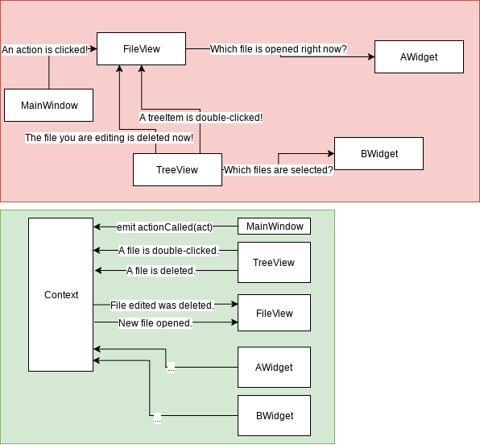

Chapter 6. Context Variables
=====================================

In this chapter, we will fill ``Context`` class with *context variables*.

You need to open the source code committed with message
``006. Context Variables`` before read the extra chapter.

What is Context Variable
----------------------------------

A *context* instance exists to provide current state of an application, and
every state change should be done by *context*. *Context holder*\ s just
let *context* know their state.

Context variable is a well-structured set of getters, setters, and events.

For our editor, I'll make 3 context variables, ``DirContextVar``,
``OpenedTreeItemContextVar``, and ``DragContextVar``.

``DirContextVar``
-------------------------

This variable stores a ``data::Dir`` instance which is currently opened.
When a ``TreeItemView`` widget, which will be introduced in the later chapter,
takes double-click event, it will call ``activateDir(double_clicked_dir)``.

The overall structure is pretty similar to ``data::SingleContainer``.

``activeDir()`` is nullable.

``OpenedTreeItemContextVar``
-------------------------------

Different from ``DirContextVar``, this does not store anything. This context
variable is purely for broadcasting, that if an ``TreeItem`` is triggered
to be opened, widgets responsible to open ``TreeItem`` will do their
appropriate action.

``openTreeItem()`` is not intended to be called with ``nullptr`` or invalid
instance, and its users do not need to cope with the case that event
``sig_treeItemOpened()`` is called with dangling pointer.

``DragContextVar``
-----------------------

This context variable is related to Qt's Drag Drop System.

In Qt Widgets library, a drag can hold an MIME data, but not something
related to C++(such as raw void pointer). This context variable solves the
problem by containing cpp data need to be delivered and let the drag
destination can access to the variable. To understand deeply, read
Qt Drag Drag. 
