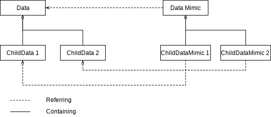
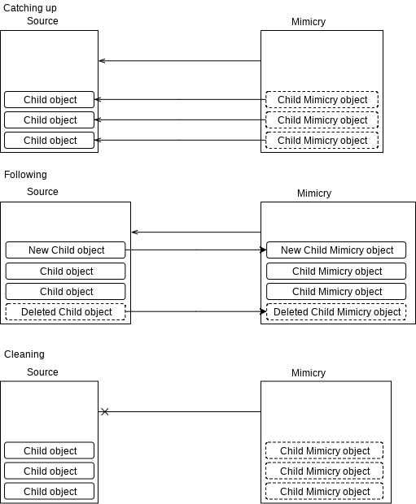

Chapter 7. GUI
============================================

In this chapter, we will implement the whole GUI from the beginning
to the end. This chapter may require you to have basic background of
Qt GUI and Model-View framework.

This chapter will be the part where the source code grows enormously,
but most of them share common patterns in their implementation.
Instead of covering all of source code, I will explain
patterns used in this part and overall UML diagram.

Not like other chapters which takes one commit per a chapter,
source code for this chapter is too long, they are separated into
multiple commits. This is the last chapter, and you can get the full
commit for this chapter by taking the latest commit.

Data Tree Mimic
----------------------------

Data Tree Mimic is a proxy pattern-like pattern which provides
object tree mimicking target data tree.

The above diagram shows relationship between source objects and mimicry objects.
There's a root mimicry object, which refers source data, and the mimicry's
children refers the source data's children as well.

To make a mimicry of a data class, it should be able to send events of
its children add/remove, and its data.

When just a mimicry object is constructed, it will not be connected with
its source data. And somewhile, the source data will be set, and the mimicry
object tries to *catch up* the source.

After it finished catching up, it starts to *follow* the source. Whenever
any of value in source data is updated, the mimicry object takes and
handles them. If they are related to children add/remove, it creates or
deletes its child mimicry type.

If the mimicry object doesn't need to follow the source longer, mimicry
deletes all of its children and disconnects every signals.

Subclassing Context Holder
----------------------------------

For some classes, ``Context`` instance is not enough to represent their
"context". For example,
``TreeItemView`` object is also part of context of ``tree_item_view_sub::View``
class.

In the overall code for GUI, subclassing ``ContextHolder`` and adding
their new context is used. If using public inheritance just for convenience
is not your flavor, you can just add ``init()`` and context-getter methods
manually, as described when I introduced ``Context`` first.

Dependency Management between ``Data`` and Data Tree Mimic
--------------------------------------------------------------------

Referring ``Data`` subclass instance commonly happens when using
mimicry pattern. In ``Data`` class, ``addDepended()``, ``removeDepended()``,
and ``purgeDepended()`` are used to manage dependency and mimicry object
is not the exception.

Mimicry object is not ``Data`` subclass, but just C++ instance, it should
use ``DependencyKey`` to identify itself. Storing its pointer(``this``) will
work in most cases without problem.

Not all of mimicry objects need to call ``addDepended()``, actually it must
not. Only root mimicry object of tree should call ``addDepended()`` when they
refer a ``Data`` instance, and ``purgeDepended()`` must be invoked when
they stop referring.

What is the difference between ``removeDepended()`` and ``purgeDepended()``?
``removeDepended()`` expect that *depended object* uses same command manager,
and understand that the depended object exists whenever ``run()`` or
``undo()`` of ``Data::solution()`` is called. While,
once ``purgeDepended()`` is called, the depended object will never invoked
in any way from ``Data::solution()`` result.

If depended object uses the same command manager or
ensured that it will live forever, use ``removeDepended()``. If it's not,
use ``purgeDepended()``.
