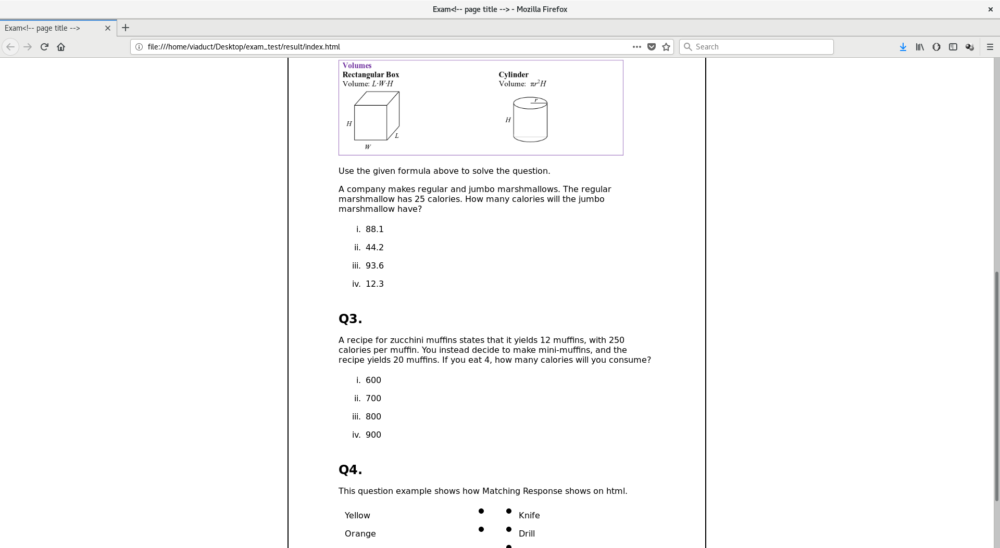
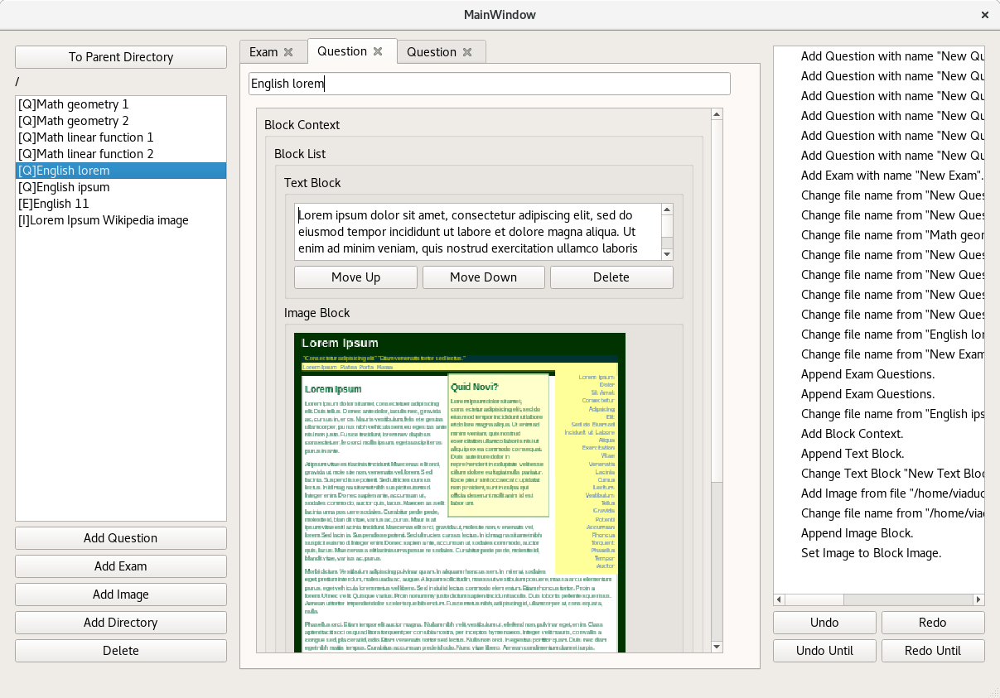

Exam Paper Editor Programming Tutorial
====================================================

Welcome to Exam Paper Editor Programming Tutorial.
Exam Paper Editor(abbreviated into EPE) is an tutorial-purpose
software to introduce its users how to write an editor software. This let
users to make questions based on text and images, combine them to form
exams, and export them in HTML format. It's written in C++ with assist of
Qt and Boost libraries.

This tutorial shows how an editor software can be built from the very
beginning. The whole source code is too long to be covered one by one,
so each of chapters concentrate on describing major issues on
writing code.

You will learn how to form a data tree, how to manage dependencies among
different data instances, how to implement undo/redo functionality,
and more.

You may need to know C++ and little bit of Qt GUI library to go through
these chapters.

The full source code is on `<https://github.com/viaduct/exam_paper_editor>`_.
It's recommended to open the source code somewhere during reading the
tutorial. 

.. warning::

	Some bugs were found after the project was pushed to Github.
	Bugs were fixed, but it will not applied to previous commit: only for
	the latest commit.

.. toctree::
	:maxdepth: 1

	planning/index.rst
	chapter_001/index.rst
	chapter_002/index.rst
	chapter_003/index.rst
	chapter_004/index.rst
	chapter_005/index.rst
	chapter_006/index.rst
	chapter_007/index.rst
