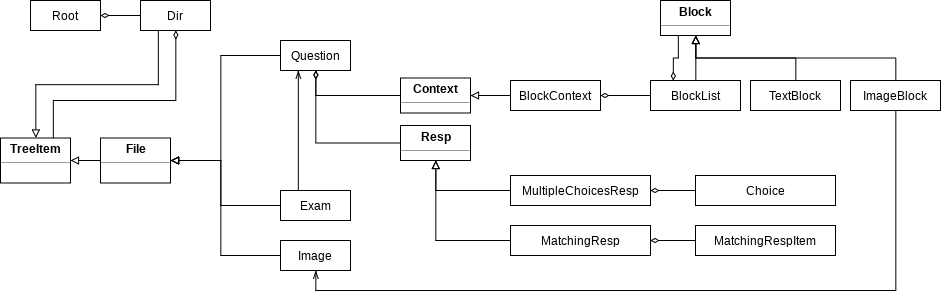

Planning
========================

Before we go into actual coding, we need proper planning. An editor is
a software to edit data, and what kind of data it will edit is going to be
our goal.

Defining Concepts
-------------------------

As described in the index page, we will build an exam paper editor which
deals with question and exam data. Then the planning should be started from
defining what are the question and exam. The following list shows definition
we will use through the overall tutorial.

Question
	A bundle of a *Context* and *Response*.

Exam
	List of *Question*\ s which has order.

Context
	Context(description, text) part of a question.

Response
	Response part of a question.

To paraphrase, a *Question* is consisit of one *Context* and one *Response*.
*Context* is literally context of a question, introducing what the question is.
*Response* is special context to take exam taker's response. Multiple choices
response is a type of response.

The above is lacking details to be implemented for editor software,
but still provides direction how the overall data structure will be. We need
to provide a space for question data so that user can make and save questions
there and use later to form exams. A space for exam data should be provided as
well. The below intended workflow explains why we need spaces for questions
and exams.

#. Users start the application.
#. They make questions. (Need to save questions in somewhere.)
#. They form exams by taking list of questions' reference. (Need to save
   exams somewhere.)
#. They choose one of the exam, and click "export" to have HTML exam paper.

To let users to well-organize their questions and exams, I decide to
implement file explorer-like system.

The image above is resource explorer of *Godot Engine*.

Concrete Structure of Data
-------------------------------

Now we get the expectation of data structure, and it's time to add details
so that it can be implemented to programing code. The following image is a
data diagram for our software.

You need to know UML class and object diagram to understand it.

All the rectangles in the diagram represents a class to form data structure.
Let's begin explaining about *Root* placed at most top left. Root is literally
a root data: it will be unique, only-one data constructed when the editor is
initialized and destructed when the editor is terminated. It contains every
other data which will be used in the editor. It takes one root *Dir* object
as root directory of the entire editor.

*Dir*, abbreviation of directory, is a type which can take other *TreeItem*
as its children. *Dir* itself is a subclass of *TreeItem* as well, and
it means a *Dir* instance can be a child of another *Dir* instance.

*TreeItem* is a type which can be contained in *Dir*. *TreeItem* subtypes
which cannot have other *TreeItem* instances inherit *File*, which inherits
*TreeItem*.

There are 3 subclasses of *File* at this moment, *Question*, *Exam*, and
*Image*. *Question* and *Exam* are those types introduced previously.
There's one more type, *Image*. *Image* takes image data, and this can be
referred by other data. Users can import an image file to *Image* instance.
Currently, there's one class referring this, *ImageBlock*.

*Question* takes one *Context* and one *Resp*.

*Context* is an abstract type, and any data classes which is intended to
be used as *Question*\ 's context can inherit this class and be placed
in *Question*.

*BlockContext* is subtype of *Context*. This uses *Block*\ 's subclasses to
form a question's context. It has one *BlockList* as child.

A *Block*\ 's instance is expected to hold data which can help to fill
a question's context. This type can be contained to *BlockList*.

*BlockList* is list container for *Block*.

*TextBlock* takes a string. This represents text part of a question's
context. *ImageBlock* is used to represent image part. *ImageBlock*
does not take image data by itself, instead, takes reference of
*Image*.

*Resp* is abbreviation of response. It's abstract type, just like *Context*,
and any type intended to be used as a question's response can inherit this and
be placed to *Question*\ 's child.

*MultipleChoicesResp* is subtype of *Resp*, which takes multiple *Choice*
instances in order.

*Choice* takes text and can be used to represent one of choice for
*MultipleChoicesResp*.

*MatchingResp* is a response type different from *MultipleChoicesResp*:
it takes 2 lists of *MatchingRespItem*, instead of one. This is because
matching response usually provides 2 columns of items and let exam takers
match the corresponding pair.

*MatchingRespItem* is just like *Choice*: it takes text and represents an
item for *MatchingResp*. The difference is that *MatchingRespItem* is intended
to be used by *MatchingResp*, while *Choice* is intended to be used by
*MultipleChoicesResp*\ .

GUI Planning
------------------------------

How the data will be shown and the users' input will be handled should
be considered as well.
There's no strict rule or pattern to be followed if
your planned GUI is enough to provide convenient data editing environment.

The image below is simple UI planning to be used for our editor.

The editor will have main window with 3 widgets placed horizontally,
*TreeItemView*, *EditorView*, and *CommandView*.

*TreeItemView* is a ListView widget which does role of explorer of *Dir*.

*EditorView* is a TabView widget which can hold *QuestionView* and
*ExamView* as its tab.

*CommandView* is a ListView widget to show command stack for undo/redo
feature.
